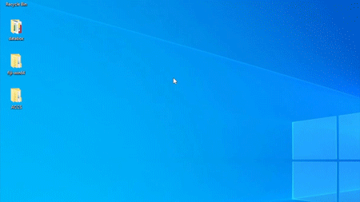

# ACCS_project (In preparation)
This project was created for the purpose of publishing ACCS source code and learning data.
The ACCS means "automatic cell counting system with the machine learning". The ACCS is the automatic counting system for measuring cells in migration assays with transwell chambers using Fiji (https://fiji.sc) and Trainable Weka Segmentation (TWS; https://imagej.net/Trainable_Weka_Segmentation).

## Benefits of the ACCS
Conventionally, the manual counting has been performed to evaluate the results of migration assays. The ACCS automatically measures cells instead of the manual counting.

## Note
This program is opened in the hope that it will be useful, but without any warranty. This system occupies the computer CPU and memory.

## Operating environment
* Operating system : Windows 10 Home (64bit)  
* Processor        : Intel (R) Core (TM) i7-8700 CPU  
* Memory (RAM)     : 16GB DDR4  
* GPU              : NVIDIA GeForce GTX 1050Ti  

## Install
1.  Install Fiji on the computer. Fiji can be downloaded from https://fiji.sc. See https://imagej.net/Fiji/Downloads for how to install Fiji. TWS is included in the Fiji plugin.
2.  Download the ACCS folder from Github (https://github.com/KPU-MASATO-Y/ACCS_project.git). Put the ACCS folder on the desktop of the computer.

## Description of the ACCS folder
The hierarchical structure of the ACCS folder is designed as follows.
* Desktop
  * ACCS
    * macro script
    * model images for machine learning
    * output
    * preparation
    * segmentation
    * test
    * unsharp mask
 
Illustrate the hierarchical structure of the ACCS folder.  

## Description of the macro script folder
The ACCS.ijm is stored in the macro script folder. The ACCS.ijm is the system code and written by ImageJ Macro Language (IJM). There is also ACCS_ver_text.txt in this folder. The ACCS_ver_text.txt is the ACCS.ijm saved in txt format.

## Description of the machine learning folder
15 image data used create learning data are stored in the model images for machine learning folder. 

## Description of the output folder
Images after measurement are output to the output folder.

## Description of the preparation folder
In the preparation folder, a model of learning data (classifier.model), trace information (trace information.arff) and an image for starting TWS are stored.

## Description of the segmentation folder
Segmented images by TWS are output to the segmentation folder.

## Description of the test folder
Save the images you want to measure in the test folder. In the initial state, sample data are saved in advane.

## Description of the unsharp mask folder
Unsharp masked images are output to the unsharp mask folder.

***
# **Usage and Demonstration**

## Usage
1. Save the images to be measured in the test folder of the ACCS folder.
2. Start Fiji.
3. Open ACCS.ijm script.
4. Run ACCS.ijm script. At that time, because the consent is required, enter "yes" when you agree. If you do not agree, enter "no" and do not measure.
5. Start measurement according to the instructions displayed on the screen. 
6. Start measurement. Measurement results are displayed on the screen during measurement.
7. When the "Please look at the items of 'Slice' and 'Count' in Summary" is displayed on the screen, the measurement is finished.
8. Save measurement results in csv format (.csv).

## Demonstration
1. Save the images to be measured in the test folder of the ACCS folder.
 *  Open the ACCS folder and open the test folder.
 *  Save the image you want to measure in this folder. This time, image data are saved in advance.  
 

2. Start Fiji  
 *  

3. Open ACCS.ijm script.
 *  File -> New -> Script
 *  File -> Open -> ACCS/macro script
 *  Open ACCS.ijm  
 
 
4. Run ACCS.ijm script.
 * Run ACCS.ijm
 * At that time, because the consent is required, enter "yes" when you agree. If you do not agree, enter "no" and do not measure.
 * Select the preparation folder.
 * Select the test folder.  
 
 
5. Start measurement according to the instructions displayed on the screen.
 * Select the unsharp mask folder.
 * Select again the unsharp mask folder.  
 

6. Start measurement. Measurement results are displayed on the screen during measurement.
 * Select the segmentation folder.
 * Select the output folder.  
 
 
7. Measuring. When the "Please look at the items of 'Slice' and 'Count' in Summary" is displayed on the screen, the measurement is finished.  
 

8. Save measurement results.
 * Save as Summary.csv.  
 
 
## References
* J. Schindelin, I. Arganda-Carreras, E. Frise, V. Kaynig, M. Longair, T. Pietzsch, S. Preibisch, C. Rueden, S. Saalfeld, B. Schmid, J.Y. Tinevez, D.J. White, V. Hartenstein, K. Eliceiri, P. Tomancak, A. Cardona, Fiji: an open-source platform for biological-image analysis, Nat. Methods 9 (2012) 676-682.
* I. Arganda-Carreras, V. Kaynig, C. Rueden, K.W. Eliceiri, J. Schindelin, A. Cardona, H. Sebastian Seung, Trainable Weka Segmentation: a machine learning tool for microscopy pixel classification, Bioinformatics 33 (2017) 2424-2426.
